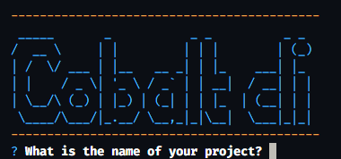

# Cobalt CLI

Cobalt CLI is a command-line tool for rapidly setting up React projects with a modern stack. This tool automates configurations and streamlines development workflows.



## Features

- Quick project setup
- Automation of configurations
- Streamlined development processes

## Installation

```bash
npm install -g cobalt

```
